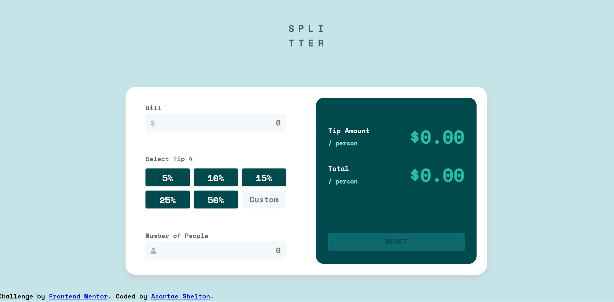
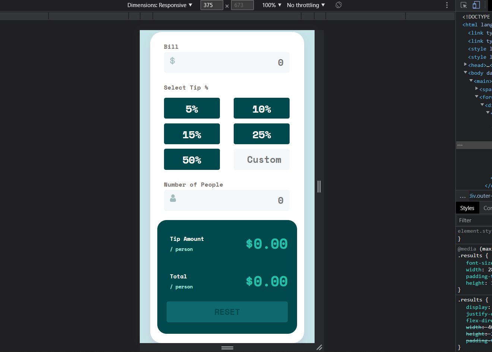

# Frontend Mentor - Tip calculator app solution

This is a solution to the [Tip calculator app challenge on Frontend Mentor](https://www.frontendmentor.io/challenges/tip-calculator-app-ugJNGbJUX). Frontend Mentor challenges help you improve your coding skills by building realistic projects.

## Table of contents

- [Overview](#overview)
  - [The challenge](#the-challenge)
  - [Screenshot](#screenshot)
  - [Links](#links)
- [My process](#my-process)
  - [Built with](#built-with)
  - [What I learned](#what-i-learned)
  - [Continued development](#continued-development)
  - [Useful resources](#useful-resources)
- [Author](#author)


## Overview

This App is able to take the total price of something, how much you would like to tip as a percentage, how many people will be splitting the total price, and output accurate information based on what was given.
Improvements that could be made include:
- limiting what can be typed in the input sections

### The challenge

Users should be able to:

- View the optimal layout for the app depending on their device's screen size
- See hover states for all interactive elements on the page
- Calculate the correct tip and total cost of the bill per person

### Screenshot




### Links

- Solution URL: [https://github.com/Asantae/FEM-Tip-Calculator-App]
- Live Site URL: [https://courageous-cranachan-1dae8d.netlify.app/]

## My process

I started by building the html sites and breaking down which 'boxes' go where. Next I moved on t the css (which took alot longer than I expected it to). After that I worked on the javascript, and kind of went back and forth between finishing the javascript and creating the mobile version as there were numerous issues I had along the way.

### Built with

- Semantic HTML5 markup
- CSS custom properties
- Flexbox
- CSS Grid
- Mobile-first workflow
- Javascript

### What I learned

Putting an svg image within an input tag was interesting an worked surpisingly
```html
<div class="userIn">
  <label for="bill">Bill</label>
  <label class="logo"><input type="number" min="1" name="bill" class="num" id="bill" placeholder="0"></input></label>
</div>
```
I have always been familiar with the hover function, but have never tried pairing it with focus and aciveas well so this was interesting
```css
#bill:hover, #bill:focus {
    outline-color:hsla(171, 71%, 77%, 1);
    cursor: pointer;
}
```
Found a js function that can loop through radio buttons when they are clicked on!
```js
for (var i = 0; i < radio.length; i++) {
    radio[i].onclick = updateTip;

}
```
### Continued development

I noticed that this apps mobile version only appears correctly in mobile desktop browsers so I want to fix that, also I would like to learn to limit/restrict the input of users somehow

### Useful resources

- [Example resource 1](https://stackoverflow.com/) - A lot of the solutions that I couldn't figure out on my own were from this site. It also provided inspiration a lot of times for different js solutions/error handling

## Author

- Frontend Mentor - [@Asantae](https://www.frontendmentor.io/profile/Asantae)
- Twitter - [@Adoxyl](https://www.twitter.com/Adoxyl)

